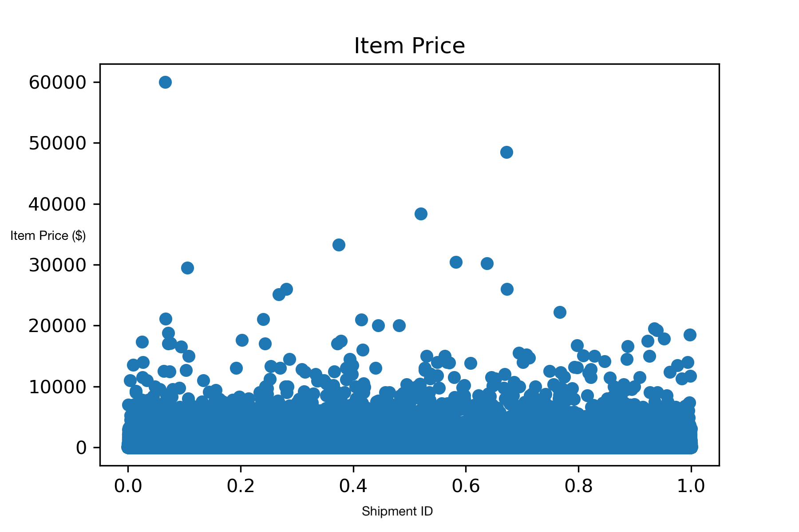

# Predicting eBay Delivery Times 
## Millie M, Meghna L, Hannah M, Nate D, Indiana H

## Update II
We have also noticed several irregularities/missing data in our dataset and made several efforts to clean the data. These efforts include:
- replacing missing `carrier_min_estimate` and `carrier_max_estimate` with the average of estimates from that same `shipment_method_id`.
- replacing missing `declared_handling_days` with averages from the same `seller_id`
- converting features represented as strings (i.e. `b2c_c2c`, `package_size`) to discrete numeric encodings
- using `weight_units` to convert all weights in `weight` to the same unit, so we can drop the `weight_unit` feature entirely
- replacing missing weights with the average weight for shipments from the same `category_id`

While we have currently handled training examples with missing features by assigning them with average values based on the rest of the data, we will need to analyze how much noise this adds to our dataset. If the noise is too great, we might need to simply omit such examples from the training set instead.

We have also begun feature engineering, and have used the `item_zip` and `buyer_zip` to engineer a new feature: `zip_distance`, which quantifies the distance between the two zipcodes. We utilized a package `uszipcode` to retrieve a latitude and longitude for zipcodes in the packages database and a package called `mpu` to calculate the haversine distance between the two points. For zipcodes that were not in the databse and returned NaNs, we temporarily decided to calculate `zip_distance` as the distance between the middle of the two states involved in the sale. All that said, after meeting with our TA, we've decided that a better stategy may be to look in to libraries that quantify the *route time* between two zip codes, rather than just the linear distance between them. However, we may have to factor in something for distances that are extremely far away, as for when when airplanes will be involved rather than truck/car routes for the whole distance.

We have put more research into tools such as XGBoost, SqueezeNet, and Fastai.tabular and how we can use them in the implementation of our network. We've used XGBoost on our cleaned data (cleaned as described above), and saw improved performance from the naive linear regression models. eBay has provided a unique loss function that they will use to evaluate our model, of which the baseline (random guessing) loss is 0.75. XGBoost was able to improve this loss to 0.50. We plan to look into packages that can help us visualize the best trees produced by XGBoost to interpret which features are most important. This knowledge could help us more strategically engineer our features. 

Once we have completed our feature engineering, we want to look into additional neural network possibilities such as CNN and RNN. More likely CNN will be our network of choice since we are not dealing with sequential data. 

## Introduction
The economy of online shopping is bigger than it has ever been and continues to grow each year. It follows that the market for being able to deliver goods quickly and reliably is becoming more and more competitive. In addition to improving the overall flow of transactions, knowing when a package will be delivered is a major factor in customer satisfaction, making the ability to accurately predict delivery dates essential to companies such as eBay.

The process of achieving this, however, poses many challenges. In the case of eBay, the majority of transactions are carried out between individual sellers and buyers, often resulting in the data for goods and their delivery being inconsistently recorded. This, in addition to packages being processed by a variety of different delivery services, means that data labels are frequently missing or incorrect. Further, the shipment date is largely left to the sole decision of each individual seller, resulting in a high degree of variability.

Our team will provide a solution to these problems and provide a model to enable the accurate prediction of delivery dates using a neural network. Because predicted values are in the range of the number of days between shipment and delivery, we will employ an architecture suitable for a discrete response rather than a continuous one.

To implement our network, a number of decisions will have to be made and tested, including deciding the optimal means by which to clean the data (for instance, whether to omit training data that has missing or incorrect features or to assign it average values based on correctly labeled training data), deciding whether to compute the estimation holistically from shipment to delivery date or to compute multiple separate estimates on separate legs of the delivery process, and deciding which features to include and in which leg.

Should our model have some error, it is important that it produces random rather than systematic error. Specifically, we want to avoid creating a model which might consistently predict early delivery dates, which could lead to sellers and delivery services rushing packages and resulting in the employment of more non-sustainable methods, such as shipping half-full boxes, as well as increasing the pressure on employees to have to work faster and faster.

Ultimately, our ideal model will be able to accurately predict the exact day of delivery 100% of the time and demonstrate which features are the most important in estimating delivery dates.

## Related Works
The current state of research for the delivery time estimation problem shows how varied and nuanced delivery data and time estimation can be. There have been studies that focus on solving complex delivery problems such as having multiple legs of shipment, but also studies that are smaller in scale and detail how delivery time estimation is calculated for food delivery services. In this section, we will describe the relevant studies that cover delivery time estimation and discuss how each of their findings are applicable to our project. 

To solve a problem that is similar to ours, logistics supplier Aramex uses machine learning to predict delivery times, claiming that its model has increased the accuracy of delivery predictions by 74%. They describe a multi-leg approach in which the shipping process is divided into multiple steps to be estimated individually. For instance, the time from seller to processing hub is estimated separately from the time from customs to buyer in international transactions. The architecture integrates systems such as Amazon Redshift clustering and Amazon SageMaker to process its data. For our project, we also explore the benefits of splitting the different legs of shipment into smaller segments; handling time and shipment time. 

Another study, “Predicting Package Delivery Time For Motorcycles In Nairobi” details how modifying the input variables for the model can help the model narrow in on important features. This study uses XGBoost, a supervised regression model, to predict the estimated time of delivery of a motorcycle-transported delivery in Nairobi. The researchers used input variables such as the client’s past orders information, the rider’s past orders information, weather, delivery distance, drop off and pickup location, and time of day. It describes the author’s approach to determining feature importance, particularly through graphics and XGBoost tree visuals. There is also a discussion of examining the results through the specific lens of a delivery date – it is better to predict late than early – and thus an optimized model should account for this by reprimanding a model harsher for predicting an early time, as opposed to a late time. We are using XGBoost as well because of its ability to determine feature importance when given a complex set of input variables.

Although it is a slightly modified problem, the researchers Araujo and Etemad (2020) document how they went about solving the problem of last-mile parcel delivery time estimation using data from Canada Post, the main postal service in Canada. They formalize the problem as an Origin-Destination Travel Time Estimation problem and compare several neural networks in order to generate the best results. Their findings indicate that a ResnNet with 8 residual convolutional blocks has the best performance, but they also explore VGG and Multi-Layer Perceptron models. We used the findings from this model to guide our choices when experimenting with different models.

Another version of the delivery time estimation problem is predicting workload (called WLC, workload control) and can be applied to predicting the delivery date in manufacturing plants. 
A paper by Romagnoli and Zammori (2019) describes how researchers set out to design a neural network that could streamline workload order (in order to minimize queues and optimize delivery dates). Their neural network had the following structure: an input layer with 12 inputs, a single output neuron delegated to make the forecast of the final delivery time, three hidden layers, each one with 32 neurons (plus a bias) with the Relu activation function, and batch normalization after each hidden layer. The authors found significant optimizations of manufacturing logistics and delivery times with their model. Initial trials to solve our problem used a neural network with a similar model, but we also modified the number of layers, inputs, and neurons to explore different structural possibilities.

Finally, there are numerous challenging elements that must be considered when solving this problem, and Wu, F., and Wu, L., (2019) cover the many difficulties of predicting package delivery time such as multiple destinations, time variant delivery status, and time invariant delivery features. Their article describes how DeepETA, their proposed framework, is a spatial-temporal sequential neural network model that uses a latest route encoder to include the location of packages and frequent pattern encoder to include historical data. There are 3 different layers to this model and through experimenting on real logistics data, the authors show that their proposed method outperforms start of the art methods. This paper is useful in identifying the challenges of predicting delivery time and how we may go about solving them.

## Update 1
#### Software we will use and type of neural network
Thus far, we have trained a naive network that uses simple linear regression. Expectedly, this model does not perform well (loss of 0.75) on our complex dataset. We want to explore different frameworks that may deal with the complexity of our dataset better:
- [XGBoost](https://xgboost.readthedocs.io/en/latest/): We read about XGBoost in one of our articles in our literature review and are interested in trying it out. XGBoost provides an implementation of gradient boosted decision trees that perform at a high level. What makes XGBoost unique is that instead of training a single model on a dataset, XGBoost combines many models together to perform the final one, training each model after the previous one and correcting errors as it goes.
- [SqueezeNet](https://arxiv.org/abs/1602.07360): We also read about different squeeze frameworks and wanted to explore squeezenet. Although it is traditionally used for image classification, we may be interested in exploring the location relationship for the zip codes in our data. We’d like to read more on CNN’s and how they work as well. 
- [Fastai.tabular](https://docs.fast.ai/tabular.learner.html): We are interested in trying out a tabular data focussed solution that works on creating embeddings for categorical variables. It allows for the user to specify the layers in the model and can be used for classification and regression. The fastai tabular learner is the same as a normal learner but it “implements a predict method specific to work on a row of data”

#### Data we will use 
eBay has provided a training dataset containing 15 million shipment records and a test dataset containing 2.5 million shipment records. Because these records are confidential, we cannot link the entire dataset here. However, the features for each shipment are outlined [here](https://github.com/milliemince/eBay-shipping-predictions/blob/main/eBay_ML_Challenge_Dataset_2021/Annexure_2021.pdf).
We have created visualizations to help us better understand the distribution of features in the dataset:
  

  
   

  
  

   
  

  
   

  

#### Shape and type of input/output
Our input is an *m x n* matrix where *n* = number of training instances = 15 million and *m* = number of features = 19.
The output of our network will be a single value: the prediction for the number of days the shipment will take.

#### To consider
 1. Some features are given as strings (i.e. package_size) that must be converted to discretely numbered values
 2. How should we deal with missing values? Many features, including weight, declared_handling_days, carrier_min_estimate, and carrier_max_estimate, have missing values. We could remove these instances entirely, but that is not ideal because the training instance is still valuable. We could replace missing data with averaged data from other, similar instances.
 3. How should we deal with outliers?
 4. How can we engineer zip codes (both from the buyer and the seller) to meaningul data? Should we create a new feature that represents the distance between both zipcodes?
 5. How can we incorporate seller_id and category_id? 

## Literature Review
#### Predicting Shipping Times with Machine Learning
Jonquais, A.C. (2019). Predicting Shipping Time with Machine Learning. Diplome d'Ingenieur, Logistique, Universite le Harve Normandie, dspace.mit.edu/bitstream/handle/1721.1/121280/Jonquais_Krempl_2019.pdf?sequence=1&isAllowed=y.

This project attempts to predict shipping times for the compnay A.P Moller-Maersk. Different models, including linear regression, random forest, and a neural network with 1 hidden layer of 50 neurons was used. Engineers trained different models for different segments of a given shipment: from booking date to receipt by shipment service, from receipt by shipment service to the departure from origin site, from the departure from origin site to arrival at point of destination, and finally from arrival at point of destination to the time the shipment was received by the buyer. 

#### End-to-End Prediction of Parcel Delivery Time with Deep Learning for Smart-City Applications
Araujo, A.C., & Etemad, A. (2020). End-to-End Prediction of Parcel Delivery Time with Deep Learning for Smart-City Applications. ArXiv, abs/2009.12197.

This paper documents how the authors went about solving the problem of last-mile parcel delivery time estimation using data from Canada Post, the main postal service in Canada. They formalize the problem as an Origin-Destination Travel Time Estimation problem and compare several neural networks in order to generate the best results. Their findings indicate that a ResnNet with 8 residual convolutional blocks has the best performance, but they also explore VGG and Multi-Layer Perceptron models.

#### DeepETA: A Spatial-Temporal Sequential Neural Network Model for Estimating Time of Arrival in Package Delivery System
Wu, F., & Wu, L. (2019). DeepETA: A Spatial-Temporal Sequential Neural Network Model for Estimating Time of Arrival in Package Delivery System. Proceedings of the AAAI Conference on Artificial Intelligence, 33(01), 774-781. doi.org/10.1609/aaai.v33i01.3301774.

This article covers the many difficulties of predicting package delivery time such as multiple destinations, time variant delivery status, and time invariant delivery features. It then describes how DeepETA, the proposed framework, is a spatial-temporal sequential neural network model that uses a latest route encoder to include the location of packages and frequent pattern encoder to include historical data. There are 3 different layers to this model and through experimenting on real logistics data, the authors show that their proposed method outperforms state of the art methods. 

#### How to Predict Shipments’ Time of Delivery with Cloud-based Machine Learning Models
Sancricca, M., & Basford, P. (2021, March 23). How to Predict Shipments’ Time of Delivery with Cloud-based Machine Learning Models. Amazon. /aws.amazon.com/blogs/industries/how-to-predict-shipments-time-of-delivery-with-cloud-based-machine-learning-models/.

The article discusses how the logistics supplier Aramex uses machine learning to predict delivery times, claiming that its model has increased the accuracy of delivery predictions by 74%. It describes a multi-leg approach in which the shipping process is divided into multiple steps to be estimated individually. For instance, the time from seller to processing hub is estimated separately from the time from customs to buyer in international transactions. The architecture integrates systems such as Amazon Redshift clustering and Amazon SageMaker to process its data.

#### Predicting Package Delivery Time For Motorcycles In Nairobi
Magiya, J. (2020). Predicting Package Delivery Time For Motorcycles In Nairobi. ResearchGate, www.researchgate.net/publication/344871967_Predicting_Package_Delivery_Time_For_Motorcycles_In_Nairobi.

This study uses XGBoost, a supervised regression model, to predict the estimated time of delivery of a motorcycle-transported delivery in Nairobi. The author decided to use input variables including the client’s past orders information, the rider’s past orders information, weather, delivery distance, drop off and pickup location, and time of day. It describes the author’s approach to determining feature importance, particularly through graphics and XGBoost tree visuals. There is also a discussion of examining the results through the specific lens of a delivery date – it is better to predict late than early – and thus an optimized model should account for this by reprimanding a model harsher for predicting an early time, as opposed to a late time.

#### How to Set Realistic Delivery Dates in High Variety Manufacturing Systems
Mezzogori D., Romagnoli G., & Zammori F. (2019). How to Set Realistic Delivery Dates in High Variety Manufacturing Systems. International Federation of Automatic Control. www.sciencedirect.com/science/article/pii/S2405896319314983.

This paper discusses how neural networks can be used to predict workload (called WLC, workload control) and ultimately delivery date in manufacturing plants. The researchers set out to design a neural network that could streamline workload order (in order to minimize queues and optimize delivery dates). Their neural network had the following structure: an input layer with 12 inputs, a single output neuron delegated to make the forecast of the final delivery time, three hidden layers, each one with 32 neurons (plus a bias) with the Relu activation function, and batch normalization after each hidden layer. The authors found significant optimizations of manufacturing logistics and delivery times with their model.

## Introduction Outline
1. Intro: We seek to build a neural network that can accurately predict shipping times for eBay. Users of eBay buy and sell various products, use various shipping providers, reside in various locations, etc. making this an interesting and challenging problem with many features.
2. Background: eBay reports that machine learning has not yet been applied to, and could be useful in, the prediction of shipping times.
3. Transition paragraph: Because predicted values are on a discrete scale (number of days), we used an ___ architecture suitable for a discrete response rather than a continuous one.
4. Details paragraph: 
Despite the enormous number of data records provided for testing, 15 million shipping records still might not be representative of the enormous number of shipments that go through Ebay every day (25 million). 
5. Assessment paragraph: Our model was able to predict eBay shipping times with an accuracy of __ and we found that the most important features in predicting shipping times were X, Y, and Z.
6. Ethics Component
  - Environmental Implications of Fast Shipping: If we begin to predict fast shipping times, the shipping infrastructure will aim to complete them in a sort of self-fulfilling model. Rushing shipping procedures often results in a slew of non-sustainable methods such as shipping half-full boxes, a method that wastes shipping materials (boxes, foam peanuts, tape) and fuel for the transportation method. 
  - Potential Bias in Dataset: Our full data set could, at most, provide one data point from 60% of eBay users. We do not know how eBay generated their dataset; if eBay pulled from a specifc region, then our model would likely be poor at predicting shipping times from other, not represented regions in the dataset.

### Project Description
Accurate predictions of product delivery times is a basic a crucial aspect of customer service for any company that deals with the transpoortation of goods from seller to buyer. For eBay, predicting delivery times is especially difficult because shipments are made by over 25 million individual sellers across the globe who have different preferred carrieres, as well as different levels of proactiveness to package and ship good shortly thereafter purchase. The range of goods sold on eBay along with the variety of sellers and buyers makes this problem interesting and challenging. The objective is to estimate the number of calendar days it will take for a buyer to receive the product after payment is made:

### payment date + handling time + transit time = delivery date 

The team will enter eBay's [evalAI Machine Learning competition](https://eval.ai/web/challenges/challenge-page/1205/overview) to get access to a training dataset of over 15 million of eBay's shipping records.

## Goals
1. Compare different NN architectures to determine which best fits problem.
2. Determine most important features for prediction (1) handling time and (2) transit time
3. Build an accurate model that can realistically be used by eBay!

